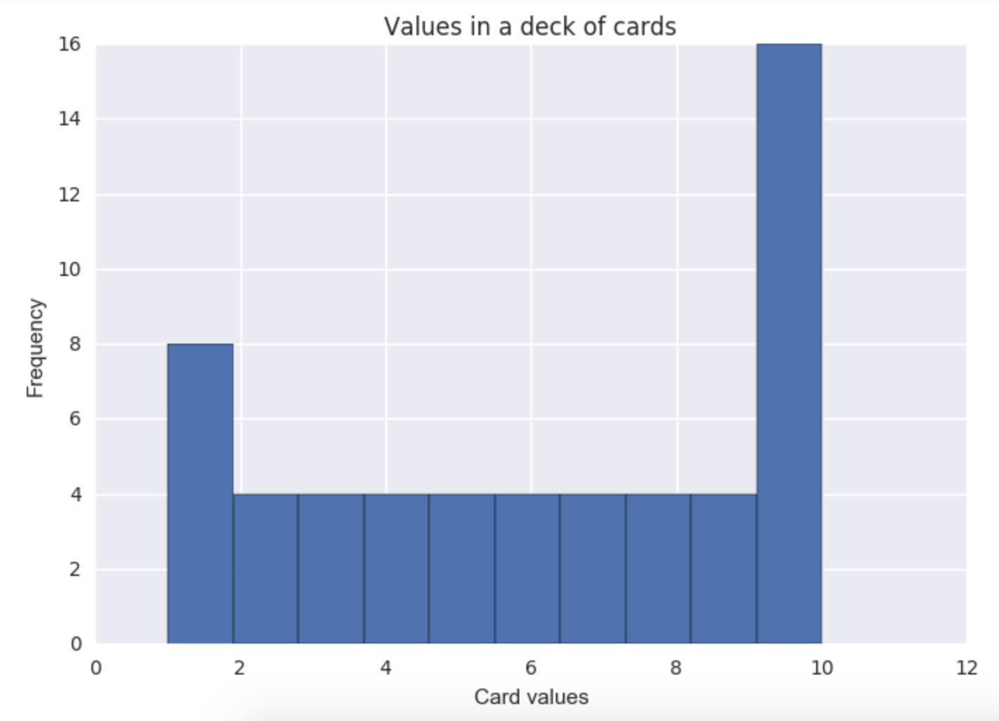
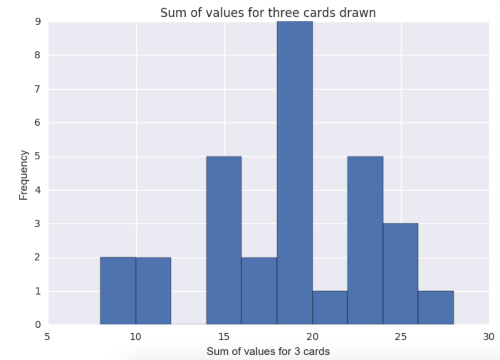

# Descriptive-statistics
This project aims to report descriptive statistics a population and a sample of the population using a standard deck of 52 cards.The deck of 52 cards divided into 4 suits (spades (♠), hearts (♥), diamonds (♦), and clubs (♣)), each suit containing thirteen cards (Ace, numbers 2-10, and face cards Jack, Queen, and King).

For the purposes of this project, each card is assigned a value: The Ace takes a value of 1, numbered cards take the value printed on the card, and the Jack, Queen, and King each take a value of 10.

First, the histogram depicting the relative frequencies of the card values.

Now, we will get samples for a new distribution. To obtain a single sample, we will draw 3 cards from it without replacement. Repeat 30 times. The plot for the sample is:

The second graph is close to a normal distribution. If the sampling size were increased it would conform closer to a normal distribution. This shape is expected from the **central limit theorem** which states that that distribution of sample means is approximately normal.
